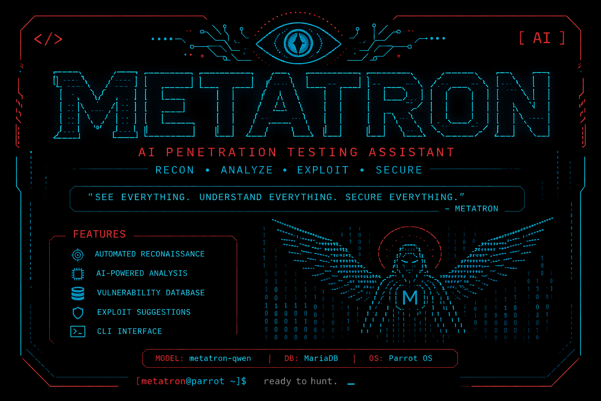
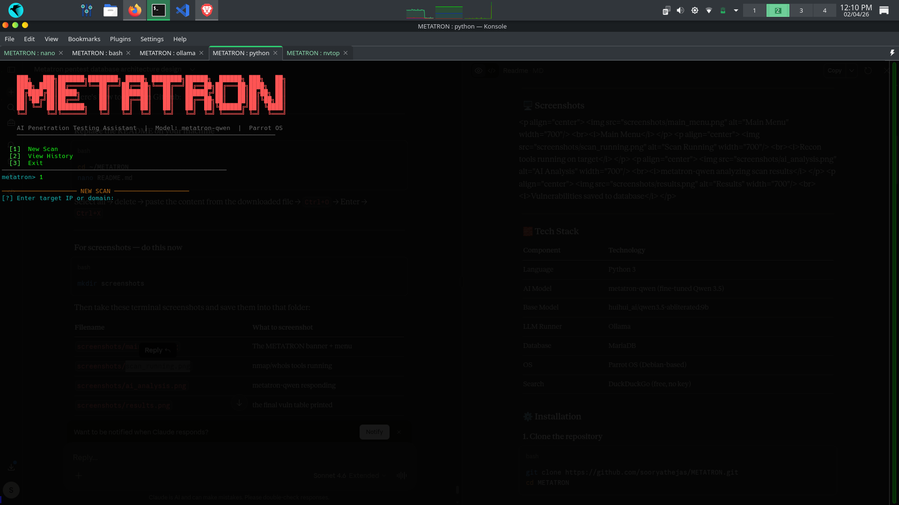
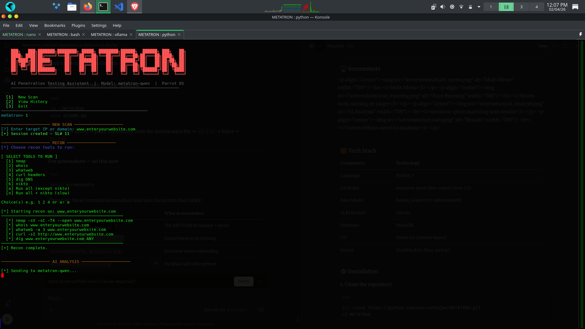
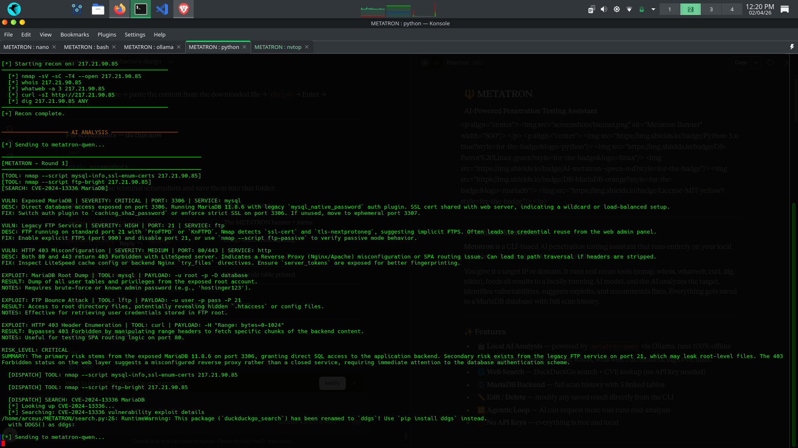
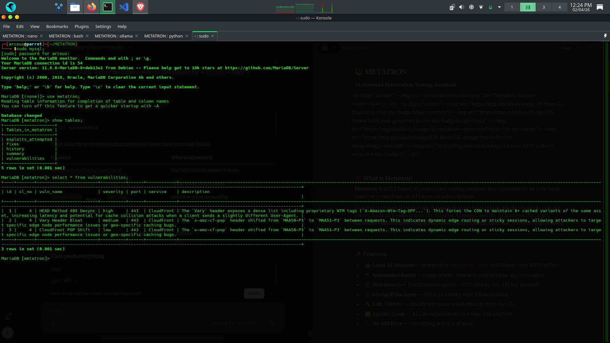
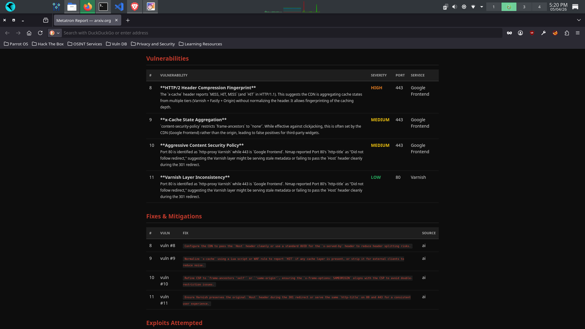

# PenTool
AI-powered penetration testing assistant using local LLM on linux (Parrot OS)
# 🔱 PenTool
### AI-Powered Penetration Testing Assistant

<p align="center">
  
</p>

<p align="center">
  
  
  
  
  
</p>

---

## 📌 What is PenTool?

**PenTool** is an AI-assisted security assessment workspace with a web dashboard and CLI. It can run with local models or connect to NVIDIA NIM and other OpenAI-compatible providers.

You give it an authorized target IP or domain. It runs the available reconnaissance tools (with native fallbacks for core checks), analyzes the evidence with the configured model, tracks findings and remediation, and produces professional PDF or HTML reports. Data is stored locally in SQLite by default.

---

## ✨ Features

- 🤖 **Flexible AI Analysis** — NVIDIA NIM, OpenAI-compatible APIs, Ollama and local runtimes
- 🔍 **Profiled Recon** — quick, standard and deep scans with selectable modules
- 🧰 **Native Fallbacks** — useful TCP, DNS, WHOIS, web fingerprint and header checks when external tools are missing
- 🌐 **Web Search** — DuckDuckGo search + CVE lookup (no API key needed)
- 🗄️ **SQLite Backend** — local scan history, evidence, findings and remediation
- ✏️ **Edit / Delete** — modify any saved result directly from the CLI
- 🔁 **Agentic Loop** — AI can request more tool runs mid-analysis
- 🩺 **System Diagnostics** — live API, database, model, LAN and tool availability
- 📤 **Professional Reports** — executive and technical PDF/HTML deliverables

PenTool allows you to export scan results into clean, shareable report formats by selecting '2.view history'->select slno and export

📄 PDF — professional vulnerability reports
🌐 HTML — browser-viewable reports
---

## 🚀 Web dashboard and local-network access

```powershell
.\.venv\Scripts\python.exe main.py
```

PenTool binds to `0.0.0.0:8000` by default. Open:

- This computer: `http://localhost:8000`
- Other devices on the same LAN: `http://<this-computer-ip>:8000`

The **Sistema** screen detects and displays the recommended LAN address. If Windows Firewall blocks another device, run PowerShell as Administrator once:

```powershell
New-NetFirewallRule -DisplayName "PenTool LAN (TCP 8000)" `
  -Description "Permite PenTool desde la subred local." `
  -Direction Inbound -Protocol TCP -LocalPort 8000 `
  -Action Allow -Profile Private,Public -RemoteAddress LocalSubnet
```

Override the binding with `PENTOOL_HOST` and `PENTOOL_PORT`; see `.env.example`.

## 🖥️ Screenshots

<p align="center">
  
  <br><i>Main Menu</i>
</p>

<p align="center">
  
  <br><i>Recon tools running on target</i>
</p>

<p align="center">
  
  <br><i>pentool-qwen analyzing scan results</i>
</p>

<p align="center">
  
  <br><i>Vulnerabilities saved to database</i>
</p>
<p align="center">  <br><i>Export scan results as PDF and or HTML</i> </p>
---

## 🧱 Tech Stack

| Component  | Technology                          |
|------------|-------------------------------------|
| Language   | Python 3                            |
| AI Model   | pentool-qwen (fine-tuned Qwen 3.5) |
| Base Model | huihui_ai/qwen3.5-abliterated:9b    |
| LLM Runner | Ollama                              |
| Database   | MariaDB                             |
| OS         | Parrot OS (Debian-based)            |
| Search     | DuckDuckGo (free, no key)           |

---

## ⚙️ Installation

### 1. Clone the repository

```bash
git clone https://github.com/sooryathejas/PenTool.git
cd PenTool
```

### 2. Create and activate virtual environment

```bash
python3 -m venv venv
source venv/bin/activate
```

### 3. Install Python dependencies

```bash
pip install -r requirements.txt
```

### 4. Install system tools

```bash
sudo apt install nmap whois whatweb curl dnsutils nikto
```

---

## 🤖 AI Model Setup

### Step 1 — Install Ollama

```bash
curl -fsSL https://ollama.com/install.sh | sh
```

### Step 2 — Download the base model

```bash
ollama pull huihui_ai/qwen3.5-abliterated:9b
```

> ⚠️ This model requires at least 8.4 GB of RAM. If your system has less, use the 4b variant:
> ```bash
> ollama pull huihui_ai/qwen3.5-abliterated:4b
> ```
> Then edit `Modelfile` and change the FROM line to the 4b model.

### Step 3 — Build the custom pentool-qwen model

The repo includes a `Modelfile` that fine-tunes the base model with pentest-specific parameters:

```bash
ollama create pentool-qwen -f Modelfile
```

This creates your local `pentool-qwen` model with:
- 16,384 token context window
- Temperature: 0.7
- Top-k: 10
- Top-p: 0.9

### Step 4 — Verify the model exists

```bash
ollama list
```

You should see `pentool-qwen` in the list.

---

## 🗄️ Database Setup

### Step 1 — Make sure MariaDB is running

```bash
sudo systemctl start mariadb
sudo systemctl enable mariadb
```

### Step 2 — Create the database and user

```bash
mysql -u root
```

```sql
CREATE DATABASE pentool;
CREATE USER 'pentool'@'localhost' IDENTIFIED BY '123';
GRANT ALL PRIVILEGES ON pentool.* TO 'pentool'@'localhost';
FLUSH PRIVILEGES;
EXIT;
```

### Step 3 — Create the tables

```bash
mysql -u pentool -p123 pentool
```

```sql
CREATE TABLE history (
  sl_no     INT AUTO_INCREMENT PRIMARY KEY,
  target    VARCHAR(255) NOT NULL,
                      scan_date DATETIME NOT NULL,
                      status    VARCHAR(50) DEFAULT 'active'
);

CREATE TABLE vulnerabilities (
  id          INT AUTO_INCREMENT PRIMARY KEY,
  sl_no       INT,
  vuln_name   TEXT,
  severity    VARCHAR(50),
                              port        VARCHAR(20),
                              service     VARCHAR(100),
                              description TEXT,
                              FOREIGN KEY (sl_no) REFERENCES history(sl_no)
);

CREATE TABLE fixes (
  id       INT AUTO_INCREMENT PRIMARY KEY,
  sl_no    INT,
  vuln_id  INT,
  fix_text TEXT,
  source   VARCHAR(50),
                    FOREIGN KEY (sl_no) REFERENCES history(sl_no),
                    FOREIGN KEY (vuln_id) REFERENCES vulnerabilities(id)
);

CREATE TABLE exploits_attempted (
  id           INT AUTO_INCREMENT PRIMARY KEY,
  sl_no        INT,
  exploit_name TEXT,
  tool_used    TEXT,
  payload      LONGTEXT,
  result       TEXT,
  notes        TEXT,
  FOREIGN KEY (sl_no) REFERENCES history(sl_no)
);

CREATE TABLE summary (
  id           INT AUTO_INCREMENT PRIMARY KEY,
  sl_no        INT,
  raw_scan     LONGTEXT,
  ai_analysis  LONGTEXT,
  risk_level   VARCHAR(50),
                      generated_at DATETIME,
                      FOREIGN KEY (sl_no) REFERENCES history(sl_no)
);
```

---

## 🚀 Usage

### Web dashboard and LLM providers

The web dashboard supports NVIDIA NIM and other OpenAI-compatible providers,
plus native Ollama connections. Start the API with:

```bash
python main.py
```

Then open `http://localhost:8000` and go to **Configuración**. Available presets
include NVIDIA NIM cloud/self-hosted, OpenAI, OpenRouter, Groq, Together AI,
DeepSeek, Mistral AI, LM Studio, vLLM/SGLang and Ollama. Use **OpenAI
compatible** for any other endpoint and customize its model, API paths,
authentication header, extra headers or request body.

For NVIDIA's hosted catalog, use:

```text
Base URL: https://integrate.api.nvidia.com/v1
API key:  nvapi-...
Model:    publisher/model-name
```

The connection test performs a minimal real inference and reports latency. API
keys are stored server-side and are not returned to the browser after saving.

PenTool needs **two terminal tabs** to run.

### Terminal 1 — Load the AI model

```bash
ollama run pentool-qwen
```

Wait until you see the `>>>` prompt. This means the model is loaded into memory and ready. You can leave this terminal running in the background.

### Terminal 2 — Launch PenTool

```bash
cd ~/PenTool
source venv/bin/activate
python pentool.py
```

---

### Walkthrough

**1. Main menu appears:**
```
  [1]  New Scan
  [2]  View History
  [3]  Exit
```

**2. Select [1] New Scan → enter your target:**
```
[?] Enter target IP or domain: 192.168.1.1
```
or
```
[?] Enter target IP or domain: example.com
```

**3. Select recon tools to run:**
```
  [1] nmap
  [2] whois
  [3] whatweb
  [4] curl headers
  [5] dig DNS
  [6] nikto
  [a] Run all (except nikto)
  [n] Run all + nikto (slow)
```

**4. PenTool runs the tools, feeds results to the AI, and prints the analysis.**

**5. Everything is saved to MariaDB automatically.**

**6. After the scan you can edit or delete any result.**

---

## 📁 Project Structure

```
PenTool/
├── pentool.py       ← main CLI entry point
├── db.py             ← MariaDB connection and all CRUD operations
├── tools.py          ← recon tool runners (nmap, whois, etc.)
├── llm.py            ← Ollama interface and AI tool dispatch loop
├── search.py         ← DuckDuckGo web search and CVE lookup
├── Modelfile         ← custom model config for pentool-qwen
├── requirements.txt  ← Python dependencies
├── .gitignore        ← excludes venv, pycache, db files
├── LICENSE           ← MIT License
├── README.md         ← this file
└── screenshots/      ← terminal screenshots for documentation
```

---

## 🗃️ Database Schema

All 5 tables are linked by `sl_no` (session number) from the `history` table:

```
history              ← one row per scan session (sl_no is the spine)
    │
    ├── vulnerabilities   ← vulns found, linked by sl_no
    │       │
    │       └── fixes     ← fixes per vuln, linked by vuln_id + sl_no
    │
    ├── exploits_attempted ← exploits tried, linked by sl_no
    │
    └── summary           ← full AI analysis dump, linked by sl_no
```

---

## ⚠️ Disclaimer

This tool is intended for **educational purposes and authorized penetration testing only**.

- Only use PenTool on systems you own or have **explicit written permission** to test.
- Unauthorized scanning or exploitation of systems is **illegal**.
- The author is not responsible for any misuse of this tool.

---

## 👤 Author

**Soorya Thejas**
- GitHub: [@sooryathejas](https://github.com/sooryathejas)

---

## 📄 License

This project is licensed under the MIT License — see the [LICENSE](LICENSE) file for details.
